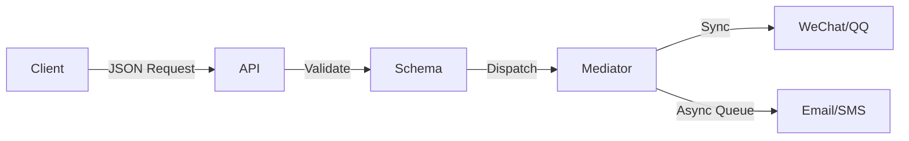

# 分享模块统一技术方案

## 任务目标
- 统一现有分散的分享功能实现
- 建立标准化分享协议和接口规范
- 提供可扩展的分享平台接入机制

## 核心设计思路
### _架构选型_
- 采用 **中介者模式** 作为核心架构，通过 `ShareMediator` 统一管理各平台分享
- 使用 **JSON Schema** 标准化分享数据协议
- 引入 **异步任务队列** 处理高延迟平台分享（如邮件、短信）

### 数据流向


## 影响范围
### 修改文件
- `share/service.go` 
  - 变更类型：接口重构
  - 涉及接口：
    - `Share(content interface{}) error` → `Share(req ShareRequest) (taskID string, err error)`
  - 修改原因：标准化输入输出

- `configs/sharing.yaml`
  - 新增配置项：
    ```yaml
    async_workers: 3  # 异步任务消费者数量
    timeout: 5000    # 同步分享超时(ms)
    ```

### 新增文件
- `share/mediator.go` 
  - 核心结构体：
    ```go
    type ShareMediator struct {
       syncClients map[string]ShareClient // 同步平台实例
       asyncQueue  chan AsyncTask         // 异步任务通道
    }
    ```

## 详细实现步骤
### 阶段1：基础定义
```go
// 标准化请求结构 (必须与前端一致)
type ShareRequest struct {
   Platform string `json:"platform"` // 平台标识码
   Content  struct {
      Title    string            `json:"title"`
      URL      string            `json:"url"`
      Meta     map[string]string `json:"meta,omitempty"`
      Callback string            `json:"callback"`    // 结果回调URL
   } `json:"content"`
}
```

### 阶段2：核心实现
1. 中介者初始化
```go
func NewMediator() *ShareMediator {
   return &ShareMediator{
      syncClients: map[string]ShareClient{
         "wechat": &WeChatClient{},
         "qq":     &QQClient{},
      },
      asyncQueue: make(chan AsyncTask, 100),
   }
}
```

2. 统一分享入口
```go
func (m *ShareMediator) Dispatch(req ShareRequest) error {
   if client, ok := m.syncClients[req.Platform]; ok {
      return client.Share(req.Content) // 同步执行
   }
   m.asyncQueue <- NewAsyncTask(req)   // 异步处理
   return nil
}
```

## 兼容性保证
- 旧版接口保留30天过渡期
- 自动转换旧参数格式
- 提供迁移检查工具：
  ```bash
  go run tools/share_migrate/check.go --path=./legacy
  ```